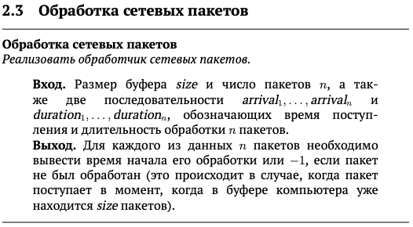
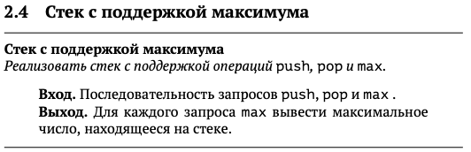
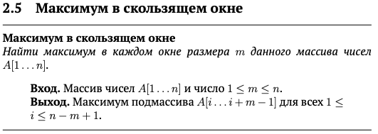

# Решения по курсу " Aлгopитмы: тeoрия и пpaктикa. Cтpуктypы дaнных" c платформы Stеpik
Основная цель курса — узнать, как устроены основные структуры данных (чтобы не пользоваться их готовыми реализациями как чёрным ящиком, а точно знать, чего от реализации ожидать), и научиться выбирать подходящую структуру данных при решении заданной вычислительной задачи.

Доступно по **[ссылке](https://stepik.org/course/1547/info)**.

>**[Задачник в формате .pdf](Tasks.pdf)**
_______________
>

✅ [Решение 2.1](2.1_Brackets_in_code/2.1_Brackets_in_code.go)
_____________________
>

✅ [Решение 2.2](2.2_Height_of_tree/2.2_Height_of_tree.go)
___________________________
>

✅ [Решение 2.3](2.3_Processing_Network_Packages/2.3_Processing_Network_Packages.go)
_______________________

>

✅ [Решение 2.4](2.4_Stack_with_max/2.4_Stack_with_max.go)
_______________________

>

⬜ [Решение 2.5]()
__________________