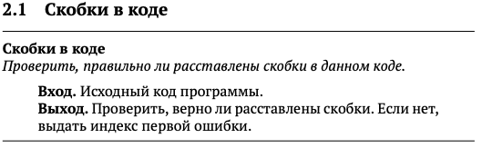
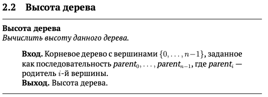

# Решения по курсу "Алгоритмы: теория и практика. Структуры данных" с платформы Stepik
Основная цель курса — узнать, как устроены основные структуры данных (чтобы не пользоваться их готовыми реализациями как чёрным ящиком, а точно знать, чего от реализации ожидать), и научиться выбирать подходящую структуру данных при решении заданной вычислительной задачи.

Доступно по **[ссылке](https://stepik.org/course/1547/info)**.

>**[Задачник в формате .pdf](Tasks.pdf)**
_______________
>

[Решение 2.1](2.1_Brackets_in_code/2.1_Brackets_in_code.go)
_____________________
>

[Решение 2.2](2.2_Height_of_tree/2.2_Hight_of_tree.go)
___________________________

>

[Решение ]()

