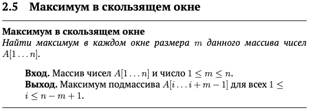

# Решения по курсу "Aлгopитмы: тeoрия и пpaктикa. Cтpуктypы дaнных" c платформы Stеpik
Основная цель курса — узнать, как устроены основные структуры данных (чтобы не пользоваться их готовыми реализациями как чёрным ящиком, а точно знать, чего от реализации ожидать), и научиться выбирать подходящую структуру данных при решении заданной вычислительной задачи.

Доступно по **[ссылке](https://stepik.org/course/1547/info)**.

>**[Задачник в формате .pdf](Tasks.pdf)**
________________

#### §2 Базовые структуры данных
_______________
>

✅ [Решение 2.1](2.1_Brackets_in_code/2.1_Brackets_in_code.go)
_____________________
>

✅ [Решение 2.2](2.2_Height_of_tree/2.2_Height_of_tree.go)
___________________________
>

✅ [Решение 2.3](2.3_Processing_Network_Packages/2.3_Processing_Network_Packages.go)
_______________________

>

✅ [Решение 2.4](2.4_Stack_with_max/2.4_Stack_with_max.go)
_______________________

>

✅ [Решение 2.5](2.5_Sliding_window_max/2.5_Sliding_window_max.go)
__________________
#### §3 Очереди с приоритетами
__________________
>

✅ [Решение 3.1](3.1_Heap_building/3.1_Heap_building.go)
_____________________
>

✅ [Решение 3.2](3.2_Parellel_processing/3.2_Parellel_processing.go)
___________________________
#### §4 Системы непересекающихся множеств
_________________________
>

✅ [Решение 4.1](4.1_Joining_tables/4.1_Joining_tables.go)
_______________________

>

✅ [Решение 4.2](4.2_Automatic_program_analysis/4.2_Automatic_program_analysis.go)
_______________________
#### §5 Хеш-таблицы
_______________________
>

⬜ [Решение 5.1](5.1_Phome_book/5.1_Phome_book.go)
_______________________
>

⬜ [Решение 5.2](5.2_Chain_hashing/5.2_Chain_hashing.go)
_______________________
>

⬜ [Решение 5.3](5.3_Search_for_a_pattern/5.3_Search_for_a_pattern.go)
_______________________
#### §6 Деревья поиска
_______________________
>

⬜ [Решение 6.1](6.1_Binary_tree_traversal/6.1_Binary_tree_traversal.go)
_______________________
>

⬜ [Решение 6.2](6.2_Checking_tree_properties/6.2_Checking_tree_properties.go)
_______________________
>

⬜ [Решение 6.3](6.3_Checking__general_properties/6.3_Checking__general_properties.go)
_______________________
>

⬜ [Решение 6.4](6.4_Set_with_sum_requests/6.4_Set_with_sum_requests.go)
_______________________
>

⬜ [Решение 6.5](6.5_Rope/6.5_Rope.go)
_______________________