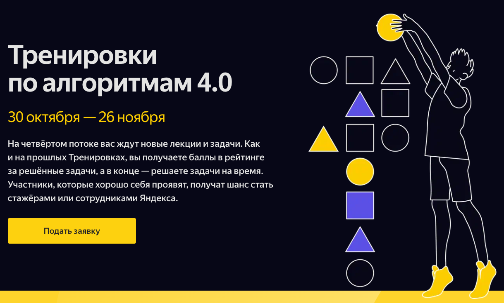

### Разминка
30.10 Открытие Тренировок и публикация задач для разминки ([Трансляция](https://youtube.com/live/id5sNdvFqdo?feature=share), [Мои решения разминки](WarmUp))
________________
### Забег
01.11 Лекция 1: Сортировки: быстрая, слиянием и поразрядная ([Трансляция](https://youtube.com/live/e3WhTm1G--o))    
04.11 Разбор заданий разминки ([Трансляция](https://youtube.com/live/7OM4ryaqHyU))  
04.11 Лекция 2: Хеши для строк ([Трансляция](https://youtube.com/live/nSgDk6P_8pI))     
08.11 Лекция 3: Кратчайшие пути во взвешенных графах ([Трансляция](https://youtu.be/sGU4xxp9N3o))   
11.11 Разбор задания 1 ([Трансляция](https://youtu.be/x1uJkaK_j9g))     
18.11 Разбор задания 2 ([Трансляция](https://youtube.com/live/-ThQ3Fnh-14))     
18.11 Лекция 4: Перебор и методы его оптимизации ([Трансляция](https://youtube.com/live/PNzrc52lrSw))   
25.11 Разбор задания 3 ([Трансляция](https://youtube.com/live/4-BDdlM1lV4))     
25.11 Разбор задания 4 ([Трансляция](https://youtube.com/live/zTdSYTwatlg))
_________
### Финал
26.11 Финальный спринт — контест