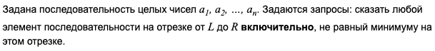
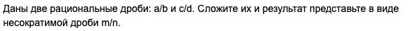
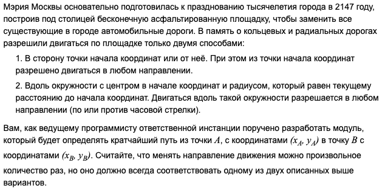
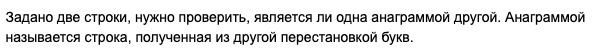
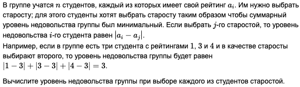
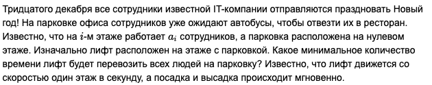
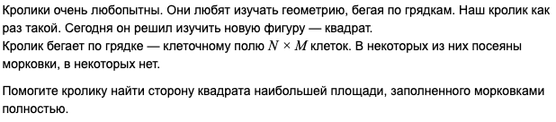
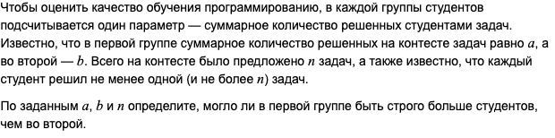
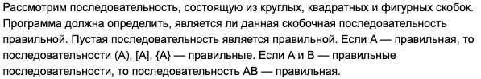
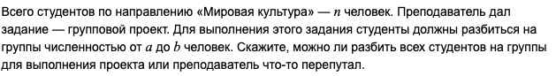

## Разминка

>[!NOTE]
>Доступно по [**ссылке**](https://contest.yandex.ru/contest/53027).
> 
> ✅ - решенные задачи 
> 🔷 - не прошли все тесты 
> ⬜ - нерешенные задачи

✅ A. [Не мининум на отрезке](A_Not_Min/A_Not_Min.go)
>
______________________
✅ B. [Сложить две дроби](B_sum_of_divs/B_Sum_of_divs.go)
>
______________________
🔷 C. [Путешествие по Москве](C_Moscow_Trip/C_Moscow_Trip.go) (9 тест)
>
______________________
✅ D. [Анаграмма?](D_Anagramm/D_Anagramm.go)
>
______________________
🔷 E. [Средний уровень](E_Middle_lvl/E_Middle_lvl_angry.go) (7 тест по времени)
>
______________________
⬜ F. [Лифт](F_Elevator/F_Elevator.go)
>
______________________
⬜ G. [Кролик учит геометрию]()
>
______________________
⬜ H. [Результаты контеста]()
>
______________________
✅ I. [Правильная скобочная последовательность](I_Brackets/I_Brackets.go)
>
______________________
⬜ J. [Групповой проект](J_Group_proj/J_Group_proj.go)
>
______________________