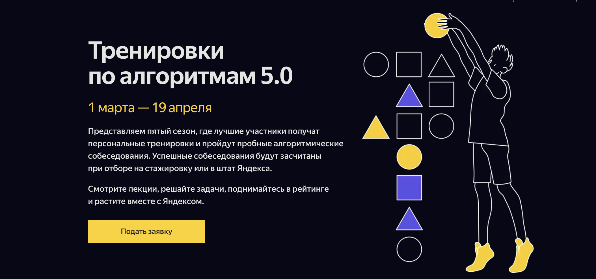

### Программа
01.03 Открытие Тренировок. Лекция 1: Сложность, тестирование, особые случаи ([Трансляция](), Занятие 1)     
06.03 Лекция 2: Линейный поиск ([Трансляция]())     
12.03 Разбор задач первой лекции ([Трансляция]())       
13.03 Собеседование по алгоримам в прямом эфире + его разбор ([Трансляция]())       
15.03 Лекция 3: Множества и словари ([Трансляция]())        
20.03 Разбор задач второй лекции ([Трансляция]())       
22.03 Лекция 4: Бинарный поиск ([Трансляция]())     
27.03 Разбор задач третьей лекции ([Трансляция]())          
28.03 Собеседование по алгоритмам в прямом эфире + его разбор ([Трансляция]())      
29.03 Разбор задач четвертой лекции ([Трансляция]())        
08 — 19.04 Проведение персональных тренировок и пробных алгоритмических собеседований для топ-участников

> [!IMPORTANT] 
> Могу ли я публиковать свои решения или добавить задачи в портфолио?
> 
>Вы можете обсуждать решения, помогать и подсказывать друг другу. Главное помнить — делиться полным решением задач публично во время Тренировок запрещено. Все решения до разбора будут проверены на списывание. Участники, замеченные за списыванием, будут удалены из турнирной таблицы. Это касается как недобросовестных участников, которые загрузили чужое решение от своего имени, так и тех, кто «дал списать».
>
>Когда Тренировки закончатся, вы сможете добавить все решённые задачи в портфолио.