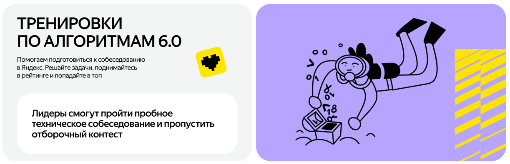

### Программа
🟡 **24.10** Открытие Тренировок. Лекция 1: Тестирование         
   > [🔗Youtube](https://www.youtube.com/live/c67zB3FWLOs), [🔗VK Video](https://vk.com/video-220652761_456239269), [🔗ДЗ](https://contest.yandex.ru/contest/66792/enter/), [🔗Мои решения ДЗ]()     

🟡 **29.10** Разбор задач первой лекции      
   > [🔗Youtube](https://www.youtube.com/live/Gk5KrTA5hpQ?feature=share), [🔗VK Video](https://vk.com/video-220652761_456239271)      

🟡 **31.10** Лекция 2: Префиксные суммы и два указателя      
   > [🔗Youtube](https://www.youtube.com/live/B4uP6igiVNU?feature=share), [🔗VK Video](https://vk.com/video-220652761_456239273), [🔗ДЗ](https://contest.yandex.ru/contest/66793/enter/), [🔗Мои решения ДЗ]()       

🟡 **05.11** Разбор задач второй лекции  
   > [🔗Youtube](https://youtube.com/live/T3-4f5SZy3Y?feature=share), [🔗VK Video](https://vk.com/video-220652761_456239275)   

🟡 **07.11** Лекция 3: Стеки, очереди, деки       
   > [🔗Youtube](https://www.youtube.com/live/km0E_i8Dtso?feature=share), [🔗VK Video](https://vk.com/video-220652761_456239277), [🔗ДЗ](https://contest.yandex.ru/contest/66794/enter/), [🔗Мои решения ДЗ]()       

🟡 **14.11** Разбор задач третьей лекции      
   > [🔗Youtube](https://www.youtube.com/live/Fg5uDgPZDoo?feature=share), [🔗VK Video](https://vk.com/video-220652761_456239280)   

🟡 **19.11** Лекция 4: Деревья, представления и обходы      
   > [🔗Youtube](https://www.youtube.com/live/O9ffppQ05-c?feature=share), [🔗VK Video](https://vk.com/video-220652761_456239283), [🔗ДЗ](https://contest.yandex.ru/contest/66795/enter/), [🔗Мои решения ДЗ]()   

🟡 **26.11** Разбор задач четвертой лекции               
   > [🔗Youtube](https://www.youtube.com/live/P6SqATvWYpY?feature=share), [🔗VK Video](https://vk.com/video-220652761_456239288)       

🟡 **28.11** МОК-интервью и его разбор           
   > [🔗Youtube](https://www.youtube.com/live/rNieihJ5U18?feature=share), [🔗VK Video](https://vk.com/video-220652761_456239290)       

🟡 **09.12.2024 - 31.01.2025** Проведение пробных технических собеседований для топ-200 участников

> [!IMPORTANT]
> Могу ли я публиковать свои решения или добавить задачи в портфолио?
>
>Вы можете обсуждать решения, помогать и подсказывать друг другу. Главное помнить — делиться полным решением задач публично во время Тренировок запрещено. Все решения до разбора будут проверены на списывание. Участники, замеченные за списыванием, будут удалены из турнирной таблицы. Это касается как недобросовестных участников, которые загрузили чужое решение от своего имени, так и тех, кто «дал списать».
>
>Когда Тренировки закончатся, вы сможете добавить все решённые задачи в портфолио.

